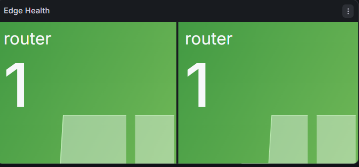
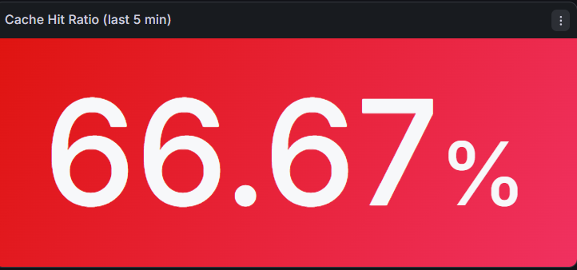

# 🚀 MiniCDN – A Production‑Grade Content Delivery Network in Pure Java

> **Live Demo:** [https://minicdn.onrender.com](https://minicdn.onrender.com)  
> **Status:** ✅ US & EU edges healthy, multi‑tier caching active, fully deployed on Render (free tier).

MiniCDN is a **fully functional, geo‑aware Content Delivery Network** built from scratch using **only Java 21** and lightweight libraries — no Spring Boot, no external caching services.  
It demonstrates the core architecture of real CDNs like Cloudflare or Akamai: request routing, consistent hashing, multi‑tier caching, stale‑while‑revalidate, health‑check‑based failover, and real‑time observability.

---

## 📸 Screenshots

| Router Dashboard (Live) | Grafana Monitoring (Local) |
|-------------------------|----------------------------|
|  |  |

*The Grafana dashboard shows global cache hit ratio, edge health, and request rate. Prometheus scrapes metrics every 5 seconds.*

---

## 🧠 Architecture
| Layer               | Role                                              |
| ------------------- | ------------------------------------------------- |
| Client              | Sends HTTPS requests                              |
| Router :8080        | Geo-IP routing, consistent hashing, reverse proxy |
| Edge US :9003       | Regional cache with Caffeine and SWR              |
| Edge EU :9002       | Regional cache with Caffeine and SWR              |
| Origin Shield :9000 | Shared cache and request collapsing               |
| Origin :8000        | Static file server                                |

### Why this design?
- **Multi‑tier caching** – Edges → Shield → Origin. The Shield collapses concurrent requests, so the origin sees only one fetch even if 100 edges ask for the same file.
- **Consistent hashing** – Each piece of content is mapped to a specific edge. When an edge fails, only its content is redistributed, not the entire CDN.
- **Stale‑while‑revalidate (SWR)** – When a cached item expires, the edge returns the stale copy while asynchronously fetching a fresh one. Combined with request collapsing, this eliminates thundering herds.

---

## 🔧 Tech Stack

| Layer              | Technology                          |
|--------------------|-------------------------------------|
| Language           | Java 21                             |
| HTTP Server        | Javalin (embedded Jetty)            |
| Caching            | Caffeine (LRU, TTL, SWR, stats)     |
| Observability      | Micrometer → Prometheus → Grafana   |
| Build              | Maven (fat JAR with dependencies)   |
| Deployment         | Docker, Render (free tier)          |
| Concurrency        | Virtual Threads (Java 21)           |

---

## ✨ Features

- **Geo‑aware routing** – Clients are mapped to the nearest edge based on their IP (`X-Forwarded-For` for testing).  
- **Consistent hashing** with 150 virtual nodes – ensures cache affinity and smooth redistribution when edges are added/removed.  
- **Multi‑tier caching** – Edge → Origin Shield → Origin. Shield collapses concurrent requests and reduces origin traffic.  
- **Stale‑while‑revalidate** – Expired content is returned immediately while the edge refreshes in the background. Request collapsing prevents duplicate origin fetches.  
- **Automatic health checking** – Router polls edges every 10 seconds. Unhealthy edges are removed; recovered edges are automatically rejoined.  
- **Cache purge** – Instant invalidation via `DELETE /purge/{path}`.  
- **Full observability** – Prometheus metrics (cache hit ratio, origin latency, edge health), Grafana dashboard with live panels.  
- **Live dashboard** – Router shows edge statuses (`UP`/`DOWN`).  
- **Zero cost** – Runs on Render’s free tier; no credit card needed for demo.

---

